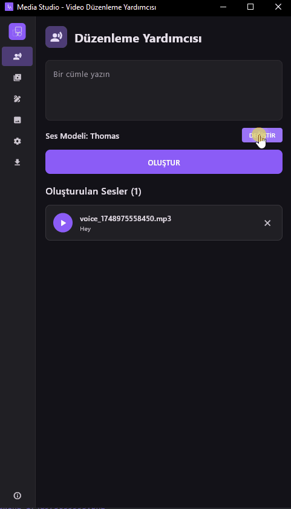

# Ruwis Media Studio

**Video düzenleyiciler için kapsamlı masaüstü yardımcısı**

Media Studio, video editörleri ve içerik üreticileri için özel olarak tasarlanmış güçlü bir Flutter masaüstü uygulamasıdır. AI destekli ses üretimi, medya arama, çizim araçları ve dosya yönetimi gibi özelliklerle, oluşturulan tüm medyaları kolayca video editörünüze sürükleyebilir ve iş akışınızı hızlandırır

## 🌟 Özellikler

### 🎤 AI Ses Oluşturma
- **ElevenLabs Entegrasyonu**: 52 farklı ses modeli ile profesyonel ses üretimi
- **Çoklu Ses Desteği**: Adam, Alice, Antoni, Drew ve daha fazlası
- **Gerçek Zamanlı Oynatma**: Üretilen sesleri anında dinleme
- **Sürükle-Bırak**: Ses dosyalarını doğrudan video editörünüze taşıyın

### 🎵 Ses Efektleri Yönetimi
- **Drag & Drop Desteği**: Ses dosyalarını kolayca ekleyin
- **Dosya Format Desteği**: MP3, WAV, M4A, OGG, AAC
- **Özelleştirme**: Ses efektlerini yeniden adlandırın ve organize edin
- **Sıralama**: ReorderableListView ile ses efektlerini sıralar

### 🎨 Çizim Aracı
- **Transparan PNG**: Video overlay'leri için mükemmel
- **Gelişmiş Fırça**: Boyut ayarlama ve renk seçici
- **Yumuşatma**: Catmull-Rom spline algoritması ile pürüzsüz çizgiler
- **Silgi Modu**: Hassas düzenleme için silgi aracı
- **Kısayol Tuşları**: Ctrl+Z ile geri alma

### 🖼️ Medya Arama
- **Çoklu Platform**: Pixabay ve Pexels entegrasyonu
- **Medya Türleri**: Resim, video, illustration, vector, GIF
- **Sonsuz Yükleme**: Pagination ile kaydırdıkça yeni içerik
- **Hızlı İndirme**: Tek tıkla medya indirme

### 📁 Dosya Yönetimi
- **Merkezi Depolama**: Tüm indirilen dosyalar tek yerde
- **Görsel Önizleme**: Resim dosyaları için thumbnail görüntüleme
- **Sürükle-Bırak**: Dosyaları video editörünüze taşıyın
- **Dosya Bilgileri**: Boyut, tür ve detay görüntüleme

## 📸 Ekran Görüntüleri




## 🚀 Kurulum

### Gereksinimler
- Flutter 3.8.1 veya üzeri
- Windows 10/11 (Desktop)
- Git

### Kurulum Adımları

1. **Projeyi klonlayın**
```bash
git clone https://github.com/ruwiss/media-studio.git
cd media-studio
```

2. **Bağımlılıkları yükleyin**
```bash
flutter pub get
```

3. **Uygulamayı çalıştırın**
```bash
flutter run -d windows
```

## ⚙️ Yapılandırma

### API Anahtarları
Uygulamanın tüm özelliklerinden yararlanmak için aşağıdaki API anahtarlarını ayarlar bölümünden girmeniz gerekmektedir:

#### ElevenLabs API
1. [ElevenLabs](https://elevenlabs.io/) hesabı oluşturun
2. API anahtarınızı alın
3. Ayarlar > ElevenLabs API Key bölümüne girin

#### Pixabay API
1. [Pixabay](https://pixabay.com/api/docs/) API hesabı oluşturun
2. API anahtarınızı alın
3. Ayarlar > Pixabay API Key bölümüne girin

#### Pexels API
1. [Pexels](https://www.pexels.com/api/) API hesabı oluşturun
2. API anahtarınızı alın
3. Ayarlar > Pexels API Key bölümüne girin

## 🛠️ Kullanılan Teknolojiler

### Flutter Paketleri
- **provider**: State management
- **http**: API iletişimi
- **audioplayers**: Ses oynatma
- **super_drag_and_drop**: Sürükle-bırak desteği
- **path_provider**: Dosya yolu yönetimi
- **shared_preferences**: Ayar saklama
- **flutter_colorpicker**: Renk seçici
- **image**: Resim işleme
- **window_manager**: Pencere yönetimi

### API Entegrasyonları
- **ElevenLabs**: AI ses üretimi
- **Pixabay**: Ücretsiz medya içeriği
- **Pexels**: Profesyonel fotoğraf ve video

## 📂 Proje Yapısı

```
lib/
├── main.dart                 # Uygulama giriş noktası
├── providers/
│   └── app_provider.dart     # Global state yönetimi
├── screens/
│   ├── home_screen.dart      # Ana ekran
│   ├── voice_screen.dart     # Ses oluşturma
│   ├── sound_effects_screen.dart # Ses efektleri
│   ├── drawing_screen.dart   # Çizim aracı
│   ├── media_screen.dart     # Medya arama
│   ├── settings_screen.dart  # Ayarlar
│   ├── downloads_screen.dart # İndirilenler
│   └── about_screen.dart     # Hakkında
├── services/
│   ├── elevenlabs_service.dart # ElevenLabs API
│   ├── pixabay_service.dart   # Pixabay API
│   ├── pexels_service.dart    # Pexels API
│   └── settings_service.dart  # Ayar yönetimi
└── widgets/
    ├── sidebar.dart          # Yan menü
    └── content_area.dart     # İçerik alanı
```

## 🤝 Katkıda Bulunma

1. Bu projeyi fork edin
2. Feature branch oluşturun (`git checkout -b feature/amazing-feature`)
3. Değişikliklerinizi commit edin (`git commit -m 'Add amazing feature'`)
4. Branch'inizi push edin (`git push origin feature/amazing-feature`)
5. Pull Request oluşturun

## 📝 Lisans

Bu proje MIT lisansı altında lisanslanmıştır. Detaylar için [LICENSE](LICENSE) dosyasına bakın.

## 🏷️ Versiyon

**v1.0.0** - İlk kararlı sürüm

## 👨‍💻 Geliştirici

**Ruwis** - [@ruwiss](https://github.com/ruwiss)

## 🔗 Bağlantılar

- [GitHub Repository](https://github.com/ruwiss/media-studio)
- [Issue Tracker](https://github.com/ruwiss/media-studio/issues)
- [Releases](https://github.com/ruwiss/media-studio/releases)


---

**Media Studio** ile video düzenleme iş akışınızı bir üst seviyeye taşıyın! 🚀
